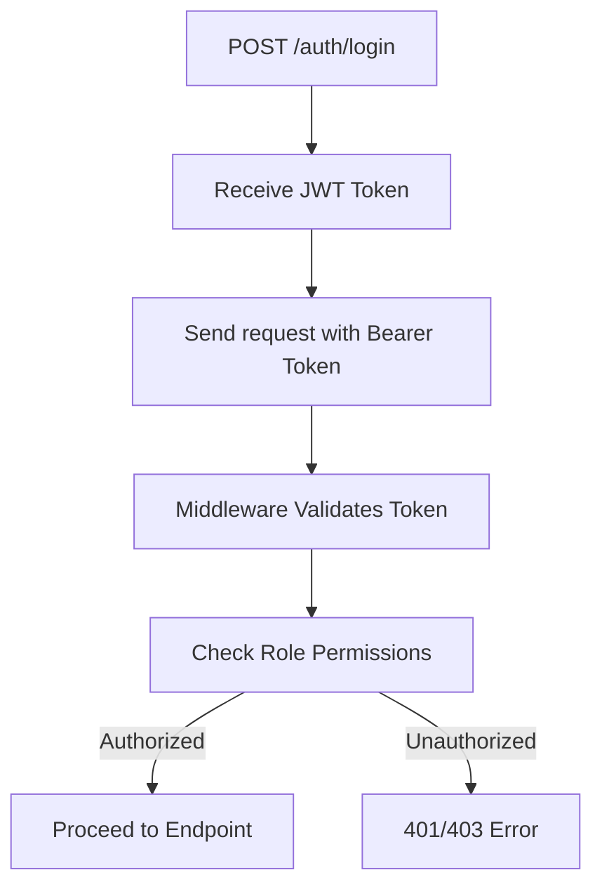

# 📦 Parcel Delivery API

A **RESTful API** to manage parcel delivery operations, supporting **role-based access control** for `Sender`, `Receiver`, and `Admin`. This API allows users to create, track, and manage parcels securely and efficiently.

---

## 🚀 Features

- **🔐 Role-Based Access Control** – Access based on user role (Sender, Receiver, Admin)
- **🛣️ Parcel Tracking** – Unique tracking ID with full status log
- **🔁 RESTful Design** – Clear and intuitive endpoints
- **⚠️ Error Handling** – Standardized responses with meaningful HTTP codes
- **✅ Success Feedback** – Consistent JSON responses for successful operations

---

## 🧑‍💼 Roles & Permissions

| Role     | Description                                     |
| -------- | ----------------------------------------------- |
| Sender   | Creates and manages their own parcels           |
| Receiver | Can view parcel details addressed to them       |
| Admin    | Full access to users and parcels                |
| Public   | Limited access to view basic parcel information |

---

## 🔐 Authorization

- All secure routes require a **JWT token** in the `Authorization` header:

  ```
  Authorization: Bearer <token>
  ```

- Middleware decodes and verifies tokens, extracting user role and ID to enforce permissions.

---

## 🧭 Endpoint Access Matrix

### 📤 Sender-Only

- `POST /parcels` – Create a new parcel
- `PATCH /parcels/cancel/:id` – Cancel a parcel (if not delivered)
- `GET /parcels/me` – View all sent parcels

### 📥 Receiver-Only

- `GET /parcels/receiver/:id` – View a parcel sent to the receiver

### 🛠 Admin-Only

- `GET /parcels` – View all parcels
- `PATCH /parcels/:id/status` – Update parcel status
- `DELETE /parcels/:id` – Delete a parcel
- `GET /users` – View all registered users

### 🌐 Public or Shared

- `GET /parcels/:id` – View public parcel details
- `GET /parcels/:id/status-log` – View parcel status history

---

## 🔁 Authorization Flow



---

## 🧱 API Endpoints Overview

### 🔐 Authentication

- `POST /auth/login` – Login and receive a JWT
- `POST /auth/register` – Register as Sender or Receiver

### 📦 Parcel Management

- `POST /parcels` – Create a parcel _(Sender-only)_
- `GET /parcels/:id` – Public parcel details
- `GET /parcels/me` – Sent parcels _(Sender-only)_
- `GET /parcels/receiver/:id` – Received parcel _(Receiver-only)_
- `PATCH /parcels/cancel/:id` – Cancel a parcel _(Sender-only)_
- `PATCH /parcels/:id/status` – Update status _(Admin-only)_
- `DELETE /parcels/:id` – Delete parcel _(Admin-only)_
- `GET /parcels/:id/status-log` – View status history _(Public)_

### 👥 User Management

- `GET /users` – View all users _(Admin-only)_

---

## 🧾 Tracking ID & Status Logs

### 🔎 Tracking ID

- Every parcel receives a **UUID**-based `trackingId` on creation.
- Used for querying parcel details and logs.

### 🧮 Status Log Format

```json
[
  {
    "status": "In Transit",
    "timestamp": "2025-08-02T18:42:00Z",
    "location": "Warehouse A"
  }
]
```

---

## ❗ Error Handling

Standardized JSON error format:

```json
{
  "error": {
    "code": "INVALID_INPUT",
    "message": "Receiver ID is required"
  }
}
```

### Common Status Codes

| Code | Description                          |
| ---- | ------------------------------------ |
| 200  | OK – Successful request              |
| 201  | Created – Resource successfully made |
| 400  | Bad Request – Invalid input          |
| 401  | Unauthorized – Invalid/missing token |
| 403  | Forbidden – No permission            |
| 404  | Not Found – Resource doesn't exist   |
| 500  | Server Error – Unexpected issue      |

---

## ✅ Success Response Example

**POST /parcels**

```json
{
  "message": "Parcel created successfully",
  "data": {
    "id": "123e4567-e89b-12d3-a456-426614174000",
    "trackingId": "TRK-xxxx-xxx",
    "senderId": "sender123",
    "receiverId": "receiver456",
    "status": "Created",
    "createdAt": "2025-08-02T22:38:00Z"
  }
}
```

---

## 🛠 Installation

```bash
# Clone the repository
git clone https://github.com/Rafsan12/Parcel_Delivery_API.git
cd Parcel_Delivery_API

# Install dependencies
npm install

# Configure environment variables
touch .env
# Add your environment values:
# PORT=5000
# JWT_SECRET=your_jwt_secret
# DATABASE_URL=your_database_url

# Run the application
npm start
```

---

## 🧪 Testing

Use **Postman** or **curl** to test the API.

Example:

```bash
curl -X POST http://localhost:3000/parcels   -H "Authorization: Bearer <your_jwt_token>"   -H "Content-Type: application/json"   -d '{"receiverId": "receiver456", "weight": 2.5, "destination": "123 Main St"}'
```

---

## 🔮 Future Improvements

- 🔔 Real-time notifications with WebSockets
- ⏱ Rate limiting and abuse protection
- 📃 Pagination for large data sets
- 📦 Integration with third-party carriers
